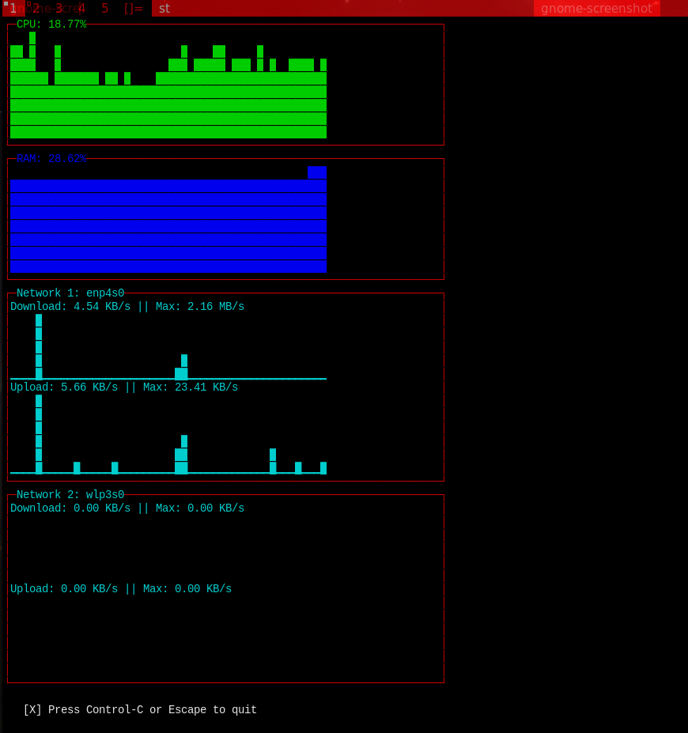

# About

This project is a small CLI app to display real-time information about your memory, cpu and network (WLAN/LAN) usage using time series.

## Installation

This works only for Unix-based systems. Windows is not allowed to play with the cool kids.
```bash
git clone https://github.com/QuodEstDubitandum/pc-stats
cd pc-stats

# You will need Go and make to install this
sudo make install

# Remove the compiled binary Go file
sudo make clean

# Uninstall 
sudo make uninstall

# Run after installation
pc-stats
```

## Preview

